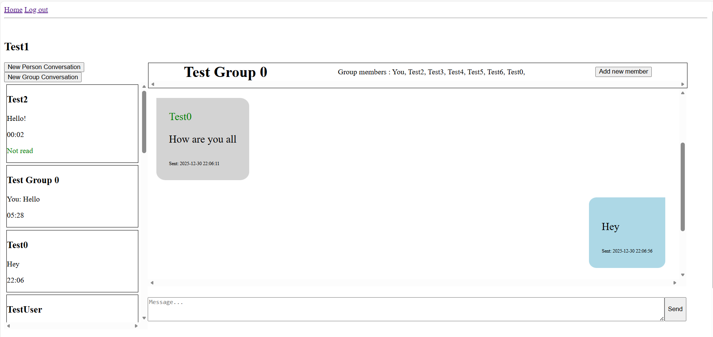

# Message App

### Video Demo:  https://youtu.be/ZI1hYLPCu7E

## A Full-Stack Messaging Platform Built with Flask
This project is a full-stack web messaging application that supports private and group conversations. It was designed as a scalable, database-driven system with a focus on backend architecture, relational modeling, and user authorization.

Rather than simply building a messaging interface, I approached this project as a systems design problem: how should conversations, users, and messages be modeled to ensure correctness, efficiency, and extensibility?

## What This Project Demonstrates
- Full-stack application design
- Relational database modeling
- Secure authentication & authorization
- REST API architecture
- Performance-aware schema decisions
- User-centered frontend interaction

## Core Capabilities
- Secure user authentication with hashed passwords
- One-to-one private messaging
- Multi-user group conversations
- Dynamic addition of group members
- Per-user “last seen message” tracking
- Authorization checks for every conversation action
- Conversations ordered by recent activity
- Responsive UI with dynamic content loading (no full page reloads)

## System Architecture

### Backend
Built with **Flask**, the backend follows RESTful design principles and separates concerns between authentication, conversation management, and message handling.

All sensitive actions (viewing, posting, adding members) are validated server-side to ensure users can only access conversations they belong to.

### Database Design
The relational schema consists of:
- `users`
- `conversations`
- `conversation_members`
- `messages`

A single indexed `messages` table is used instead of separate tables per conversation. After researching database normalization and performance tradeoffs, I implemented indexing on `(conversation_id, date)` to ensure efficient retrieval while maintaining clean schema design.

This structure allows:
- Efficient message queries
- Accurate membership tracking
- Per-user message state management

## Frontend & User Experience
The frontend uses JavaScript to asynchronously fetch and render conversations through API endpoints. This eliminates unnecessary page navigation and creates a smoother messaging experience.

The UI adapts to different screen sizes and maintains a clear separation between the conversation list and active message view.

## Engineering Decisions & Tradeoffs

**Schema Design:**
Initially considered storing messages in separate tables per conversation. After studying relational database best practices, I consolidated messages into a single indexed table to improve scalability and maintain normalization.

**RESTful Routing:**  
Adopted resource-based route naming for clarity and extensibility.

**Security:**  
Implemented strict authorization checks at the server level rather than relying on frontend restrictions.

## Future Improvements
- Real-time messaging with WebSockets
- Push notifications
- Media support
- Conversation deletion and moderation tools
- Improved performance under high message volume

